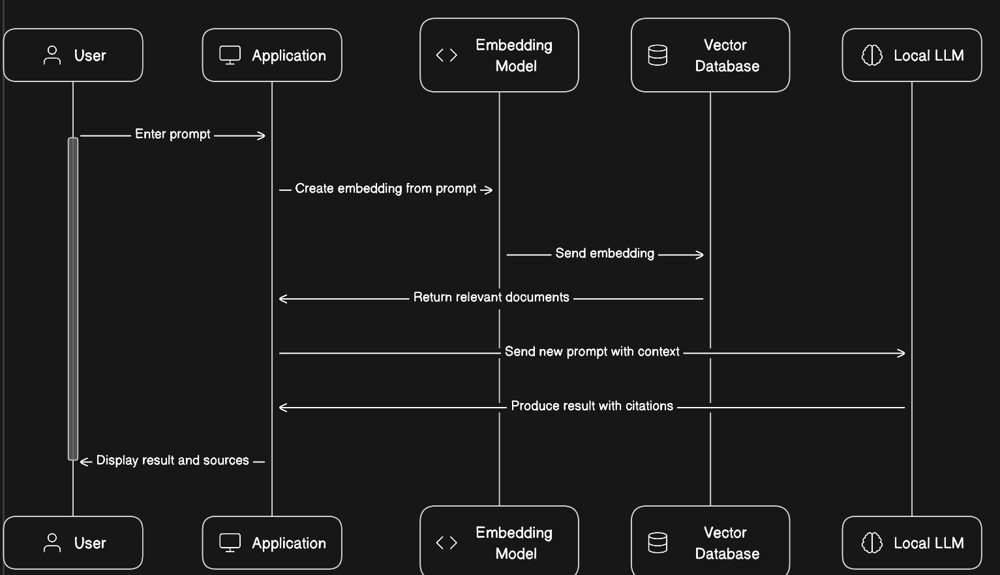

# Network-Security-Quizbot

## Project Description:
The project involves implementing a chat bot with question-answering capabilities using a Large Language Model (LLM). The bot is designed to engage with network security documents, specifically from presentation slides, questionaires, quizzes and assignments related to our network security course, serving as a knowledge base. Operating locally, the bot addresses security concerns related to data transmission over the internet. It can handle multiple-choice questions, true/false questions, and open-ended questions by leveraging the GPT-4 All model for natural language understanding and generation. Document embeddings are generated using Hugging Face InstructEmbeddings, and Faiss is employed to create a Vector Database for efficient document retrieval.

## Prerequisites (Virtual Environment Setup):
- Python v3.9
- PIP (Python package installer)
- Visual Studio Code

## Requirements:
### In-built Python Packages:
- `textwrap`: Provides functions for wrapping, filling, and formatting plain text.
- `pickle`: Implements binary protocols for serializing and de-serializing a Python object structure.

### Framework with Required Libraries:
- **Langchain**: A Python framework for creating applications using Large Language Models, equipped with powerful libraries.

### Required Libraries:
- `pypdf`: A Python library for reading PDF files.
- `sentence_transformers`: A Python library for computing sentence embeddings.
- `faiss-cpu`: A Python library for similarity search and clustering of dense vectors.
- `gpt4all`: A library or tool for working with GPT-4 language models.
- **Hugging Face Model**: Used for InstructEmbeddings.
- `InstructorEmbedding`: A custom module or library for generating instructor embeddings.

## System Architecture:

1. **User Input Processing:**
   - The user provides questions in multiple-choice, true/false, or open-ended format.
   - Input processing involves converting the user's question into a format suitable for the language model.

2. **GPT-4 All for Natural Language Understanding:**
   - Utilizes the GPT-4 All model to understand and generate natural language responses.
   - The model is responsible for handling open-ended questions and providing context-aware responses.

3. **Document Retrieval using Faiss:**
   - The Faiss library is employed to efficiently search the Vector Database for relevant documents.
   - Faiss facilitates similarity search and clustering of dense vectors, enhancing document retrieval speed.

4. **InstructEmbeddings for Document Embeddings:**
   - Hugging Face InstructEmbeddings are used to generate embeddings for the network security documents.
   - These embeddings capture the semantic information of the documents, aiding in question-answering.

5. **Combining Language Model and Embeddings:**
   - The bot intelligently combines information from the language model and document embeddings to generate context-aware responses.
   - This fusion enhances the accuracy and relevance of the bot's answers.

6. **Output Delivery:**
   - The bot delivers the response to the user, addressing their query regarding network security.

  |  

## Step by Step Instructions for Execution:
- Unzip the code's zipped file.
- install virtual environment if not available. (pip install virtualenv)
- create an virtual environment inside the folder. (py -m virtualenv venv)
- enter virtual env (venv/Scripts/activate)
- install required libraries from requirements.txt (pip install -r requirements.txt)
- run main.py file (py main.py)

## Features:

- **Question Types:** Supports multiple-choice, true/false, and open-ended questions. Accepts text-based questions and provides text-based responses
- **Context-aware Responses:** Integrates language model outputs with document embeddings for context-aware answers.
- **Efficient Document Retrieval:** Faiss-based Vector Database ensures quick and relevant document retrieval.

## Training Data and Data Formats:

- **Training Data:** Network security documents, presentation slides, and books related to the network security course.
- **Data Formats:** PDF files for documents, formatted inputs for multiple-choice and true/false questions.

## Issues Experienced:

- **Training Data Quality:** Ensuring high-quality and diverse training data for both the language model and document embeddings.
- **Performance Optimization:** Optimizing the performance of document retrieval using Faiss for larger document repositories.

## Conclusion:

The bot demonstrates an effective fusion of language models, document embeddings, and efficient document retrieval mechanisms. The integration of GPT-4 All, Hugging Face InstructEmbeddings, and Faiss contributes to the bot's ability to deliver context-aware responses, addressing user queries related to network security with precision. Ongoing improvements can be made by refining the training data and optimizing performance for scalability.
